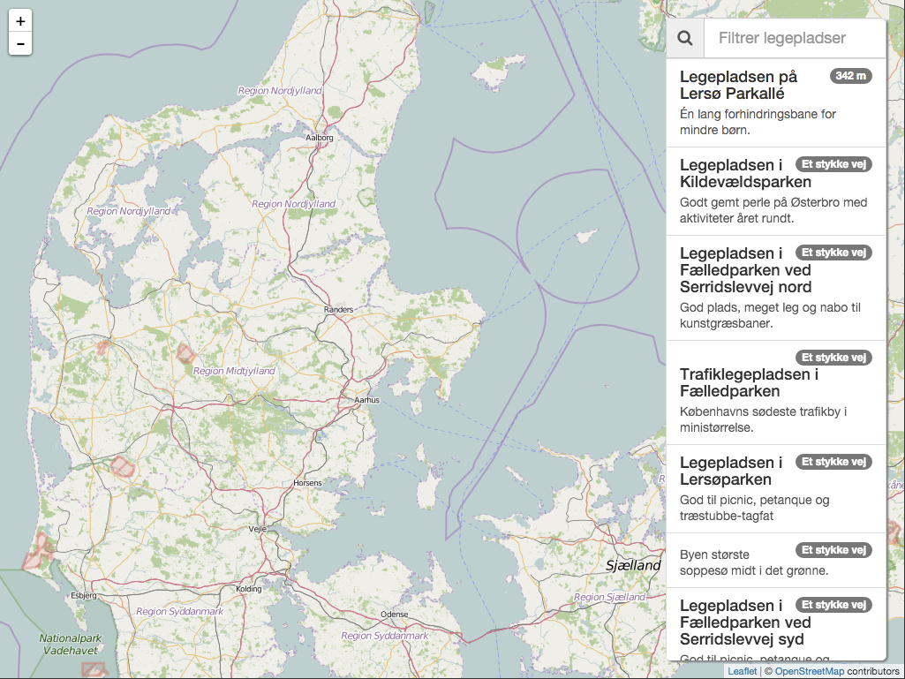

# playgrounds
This repository contains the same Playgrounds application implemented in different ways. Kinda like the [TodoMVC](http://todomvc.com/)

The playground application contains a list of Copenhagen playgrounds. The playgrounds will be sorted so that the closest ones are at the top of the list.

Selecting the playground will show the position on the map and a summary of this playground.

## angular-with-scope

The classic AngularJS application using the `$scope` in the controllers and directives.

## angular-controller-as

Using the newer and preferred `controllerAs` syntax instead of `$scope`

The directives uses the `bindToController`.

`$scope` will still be used for watching the model.

## angular-typescript

Using [TypeScript](http://www.typescriptlang.org/) to create the playground application.

So what does TypeScript gives us? It gives us classes, interfaces, generics etc. And why would we want that? First of all classes, interfaces etc is a way of working that many developers get. We also get a lot more help form the IDE, automated and secure refactoring and then we get a compiler that gives us compile time errors instead of runtime errors.

All these things make a lot of sense, even more so when working on larger projects with a longer life expectancy and with developers with different skills sets.

## Swift

A mobile application doing the same thing. This time made using [swift](https://developer.apple.com/swift/)