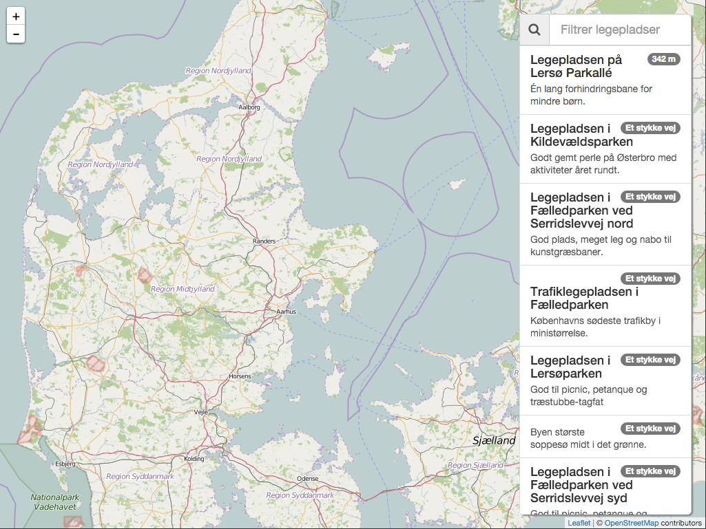
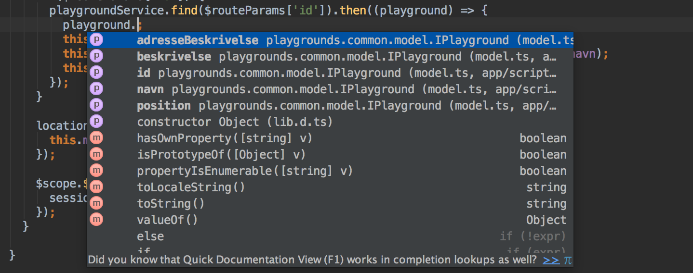
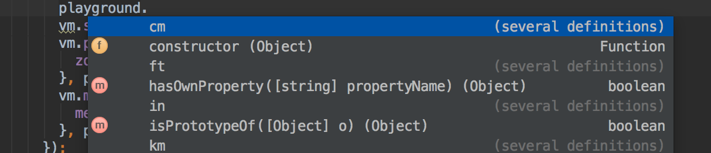
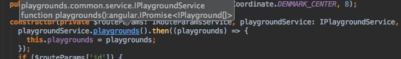

# AngularJS med TypeScript

## Introduktion
AngularJS er blevet populært hos mange danske virksomheder. En af de attraktive ting ved AngularJS er at man finder mange af de samme dyder i [AngularJS](https://angularjs.org/) som man finder i eksempelvis Java & C#.

Man har “separation of concern” der klart definerer hvorledes ens applikation bør opsplittes. Vi har vores services til vores forretningslogik, vi har vores controllers til at dirigere sammenhængen med brugergrænsefladen og forretningslogikken. Vi har vores directives og filters til præsentation osv.

Alt dette gør det nemmere for folk med erfaring i det klassiske MVC mønster at komme i gang. Samtidig får man delt sin kode op i mindre bidder, som dermed både er lettere at genbruge, men bestemt også lettere at teste.

Men én ting mangler stadigvæk. Typer! Løsningsmulighed: [TypeScript](http://www.typescriptlang.org/). Hvad er [TypeScript](http://www.typescriptlang.org/)? I følge Microsoft:

> TypeScript is a typed superset of JavaScript that compiles to plain JavaScript.

Så med [TypeScript](http://www.typescriptlang.org/) får vi altså igen interfaces, klasser, generics etc.

## Case - Legepladser
I forbindelse med jeg har afholdt [AngularJS foundation](https://www.lundogbendsen.dk/undervisning/beskrivelse/LB1730/JS+-+AngularJS+-+Foundation;jsessionid=C8B2C9CCCEA83B5B27A05BFB76BDC4E3) kurser for Lund&Bendsen, har kursisterne skulle udvikle en lille applikation, som benytter sig af [Copenhagen Data](http://data.kk.dk/) til at vise en liste af legepladser i København.



Applikationen er skrevet i ren Javascript med [AngularJS](https://angularjs.org/). Men hvad kræver det at gå fra en type løs applikation til en applikation der benytter [TypeScript](http://www.typescriptlang.org/)? Lad os se på de forskellige dele.

### Modellen
Der er umiddelbart to modeller i denne case. Der er modellen man får fra Copenhagen Data og så er der den interne model. Når vi benytter ren Javascript er modellen ikke defineret, mens vi med [TypeScript](http://www.typescriptlang.org/) kan og bør definere disse to modeller. Dette kan vi gøre vha. interfaces. Den interne legeplads er defineret således:

```javascript
export interface ICoordinate {
  lat: number;
  lng: number;
}

export interface IPlayground {
  id: string;
  navn: string;
  adresseBeskrivelse?: string;
  beskrivelse?: string;
  position: ICoordinate;
}
```
Dette interface fortæller at et legeplads objektet **skal** have `id`, `navn` og `position`. Legeplads objektet **kan** have `adresseBeskrivelse` og `beskrivelse`. Dette kan ses via `?` der står efter navnet. Hvad giver det af fordele?

#### Compiling

Hvis vi ved en fejl benytter `name` i stedet for `navn`, ville det være en fejl vi først ville finde på runtime når vi bruger Javascript. Benytter vi [TypeScript](http://www.typescriptlang.org/) får vi fejlen på compile time:

```
>> app/scripts/map/map.ts(58,22): error TS2339: Property 'name' does not exist on type 'IPlayground'.
```

Dette synes jeg er en kæmpe fordel.

#### IDE
En anden fordel ved definerede typer, eks. `IPlayground`, er at vores IDE nu kan hjælpe os.

Vi har nu Code Completion, da vores IDE kender typerne:



Som vi kan se kender vores IDE ikke bare `IPlayground`'s egne properties, men også de nedarvede properties, eks. `toString`

Uden `IPlayground` typen er vores IDE til stortset ingen hjælp:



### Service

I vores case med legepladser skal kursisterne lave en service der henter legepladserne fra Copenhagen Data. Servicen har en metode der returnerer et promise, der når legepladserne er hentet, afleverer et array med `IPlayground`s.

Med [TypeScript](http://www.typescriptlang.org/) skriver vi vores services som klasser. Og på samme måde som med vores model, opretter vi et interface der beskriver de funktioner vores service skal implementere. I denne case kommer interfacet til at se således ud:

```javascript
export interface IPlaygroundService {
  playgrounds(): angular.IPromise<IPlayground[]>;
  find(id: string): angular.IPromise<IPlayground>;
}
```
Og selve service klassen:

```javascript
class PlaygroundService implements IPlaygroundService {
  public playgrounds(): angular.IPromise<IPlayground[]> {
    ...
  }

  public find(id: string): angular.IPromise<IPlayground> {
    ...
  }
}

```
Det er desværre ikke specielt elegant at få registeret en service i [AngularJS](https://angularjs.org/), når man benytter [TypeScript](http://www.typescriptlang.org/) klasser til sine services. Men med en relativ simple statisk factory metode på klassen fungerer det nogenlunde:

```javascript
class PlaygroundService implements IPlaygroundService {

  ...

  public static factory() {
    const service = ($http: angular.IHttpService, location: ILocationService) => {
      return new PlaygroundService($http, location);
    };
    service.$inject = ['$http', 'location'];
    return service;
  }
}

angular.module('playgrounds')
  .factory('playgroundService', PlaygroundService.factory());

```

Når `IPlaygroundService` bliver injected i eksempelvis en controller, vil vores IDE hjælpe os med hvilke funktioner vi kan kalde og vores compiler vil give fejl, hvis vi benytter funktioner der ikke findes.

Eksempel hvor jeg benytter servicen:

```javascript
class MapCtrl implements IMapScope {

  public playgrounds: IPlayground[];

  constructor($scope: angular.IScope, private $routeParams: angular.route.IRouteParamsService, playgroundService: IPlaygroundService, location: ILocationService) {
    playgroundService.playgrounds().then((playgrounds) => {
      this.playgrounds = playgrounds;
    });
    ...
  }
}
```
Hvis vi kigger i vores IDE, kan man se at typen er kendt.



I dette eksempel kender IDE'et returtypen `angular.IPromise<IPlayground[]>` fra vores `playgrounds()` funktion.


### Controller

Når vi benytter [TypeScript](http://www.typescriptlang.org/) skriver vi vores controllers som klasser. Det er let at benytte controllerAs syntax sammen med [TypeScript](http://www.typescriptlang.org/), hvilket også er den syntax jeg vil benytte i eksemplet. Eksemplet jeg vil vise er den controller der benyttes til at håndtere kortet og listen af legepladser.

Vi starter med at definere de properties og funktioner som vores UI har brug for:

```javascript
interface IMapScope {
  filterTextService: IFilterTextService;
  markers: IMarker;
  playgroundCenter: ICoordinate;
  playgrounds: IPlayground[];
  selectedPlayground: IPlayground;
}
```

Efterfølgende implementerer vi selve klassen.

I [TypeScript](http://www.typescriptlang.org/) har vi en constructor funktion. Vi benytter denne til at få injected de afhængigheder controlleren har.

```javascript
class MapCtrl implements IMapScope {

  public static $inject = ['$scope', '$routeParams', 'playgroundService', 'location', 'filterTextService'];

  public playgrounds: IPlayground[];
  public selectedPlayground: IPlayground;
  public markers: IMarker = {};
  public playgroundCenter: ICoordinate = new MapCenter(Coordinate.DENMARK_CENTER, 8);

  constructor(private $routeParams: IRouteParamsService, playgroundService: IPlaygroundService, location: ILocationService, public filterTextService: IFilterTextService) {
    if ($routeParams['id']) {
      playgroundService.find($routeParams['id']).then((playground) => {
        this.selectedPlayground = playground;
        this.markers['playground'] = new MapMarker(playground.position, playground.navn);
        this.playgroundCenter = new MapCenter(playground.position);
      });
    }
    playgroundService.playgrounds().then((playgrounds) => {
      this.playgrounds = playgrounds;
    });
    location.get().then((coordinates) => {
      this.markers['meMarker'] = new MapMarker(coordinates, 'Her er jeg');
    });
  }
}
```
Constructoren er også stedet vi udfører de ting der skal ske i forbindelse med at controlleren instantieres. I dette tilfælde henter vi legepladserne, og hvis der er valgt en specifik legeplads, så henter vi denne.

Læg mærke til `$inject`. Dette statiske string array er nødvendigt, hvis vi ønsker at kunne [uglify](https://github.com/gruntjs/grunt-contrib-uglify) vores JS kode.

Hvor det er en smule bøvlet at registere en service med [AngularJS](https://angularjs.org/) og [TypeScript](http://www.typescriptlang.org/), er det super simpelt med controllers. Her angiver vi blot vores klasse som controller function.

```javascript
angular.module('playgrounds')
  .controller('MapCtrl', MapCtrl);  
```

Fordelen ved at have sin controllers i [TypeScript](http://www.typescriptlang.org/) er at vi får compiler og IDE support under udviklingen af controlleren. Desværre kan [Webstorm](https://www.jetbrains.com/webstorm/) endnu ikke hjælpe når vi først er i vores HTML templates.

### Directives

Når vi laver directives laver vi det på samme måde som services og controllers. Vi laver det med klasser. Klassen vi implementerer bør benytte interfacet `angular.IDirective`.

```javascript
class MyRating implements angular.IDirective {
  public restrict = 'E';
  public templateUrl = 'scripts/common/directives/my-rating.tmpl.html';
  public bindToController = {
    rating: '=',
    readOnly: '='
  };
  public scope = {};
  public controllerAs = 'vm';
  public controller = MyRatingController;

  public link(scope: angular.IScope, element: angular.IAugmentedJQuery, attrs: angular.IAttributes, vm: MyRatingController) {
    ...
  }
```

Som vi ser her, så kan de enkelte konfigurations properties blot defineres direkte på klassen.

Det giver os muligheden for senere at nedarve fra denne klasse og lave en variant af vores directive. Jeg har ikke selv haft dette behov, men muligheden eksisterer i hvert fald, når vi benytter klasser til vores directives.

Som det kan ses fra eksemplet er det selvfølgelig også muligt at benytte `bindToController` istedet for isolated `scope`, når man benytter [TypeScript](http://www.typescriptlang.org/).

Ligesom med services, er det lidt bøvlet at registere et directive der er lavet som klasse i angular. Det er dog den præcis den metode, som med services.

```javascript
class MyRating implements angular.IDirective {

  ...

  public static factory() {
    const directive = (): angular.IDirective => {
      return new MyRating();
    };
    return directive;
  }
}

angular.module('playgrounds')
  .directive('myRating', MyRating.factory());
```

### Filters ###

Selvom vi ikke implementere filtre som klasser, kan vi godt få glæde at [TypeScript](http://www.typescriptlang.org/)'s typer. Mest ved udviklingen af filteret og ikke ved brug af filteret.

I forbindelse med kurset skal kursisterne lave et `distance` filter. Dette filter skal vha. din position og legepladsens position beregne afstanden mellem de to. Lad os starte med at definere interfacet for denne operation:

```javascript
export interface IDistanceFilter {
  (position: ICoordinate): string|number;
}
```

Som vi kan se fra `IDistanceFilter` så beskriver interfacet én funktion som tager én parameter, som er af type `ICoordinate`. Filter funktionen returnerer enten en string eller et nummer, som kan ses via `string|number`. Dette skyldes at hvis din position ikke er fastlagt, så kan distancen ikke beregnes, og der returneres i stedet for beskeden 'Ukendt'.

Næste skridt er at lave filteret der returnerer filter funktionen, der implementerer `IDistanceFilter`.
```javascript
const distance = (location: ILocationService): IDistanceFilter => {

  let currentPosition: ICoordinate;

  location.get().then((position) => {
    currentPosition = position;
  });

  return (position: ICoordinate): number|string => {
    if (currentPosition && position) {
      return geolib.getDistance(currentPosition, position);
    }
    return 'Ukendt';
  };
};
distance.$inject = ['location'];
```
Vi opretter en `distance` funktion som tager en parameter: `location`. Parameteren bliver dependency injected af [AngularJS](https://angularjs.org/). Funktionen selv returnerer en funktion der implementerer vores `IDistanceFilter`.

Sidst tilføjer vi vores `$inject` property, for at vores filter kan fungerer med [uglify](https://github.com/gruntjs/grunt-contrib-uglify).

At registere vores filter med [AngularJS](https://angularjs.org/) er super simpelt:

```javascript
angular.module('playgrounds')
  .filter('distance', distance);
```
Når vi benytter vores filter i en template får vi desværre ingen hjælp fra [Webstorm](https://www.jetbrains.com/webstorm/). Dvs. at der er ingen Code Completion etc. Dog giver vores typet interface os en fordel, hvis vi injecter vores filter i en controller, service eller directive. Eller når vi injecter den i vores test af filteret.

```javascript
beforeEach(inject((_humanizeDistanceFilter_: IHumanizeDistanceFilter) => {
  humanizer = _humanizeDistanceFilter_;
}));
```

### 3. part biblioteker

I de eksempler vi har kigget på har vi primært benyttet vores egne typer. Men som i sikkert har bemærket har vi også benyttet andre typer. Eksemplvis `angular.IPromise<IPlayground[]>`. Hvor kommer denne type fra? I TypeScript kan man angive en reference til definitioner. Eks.:

```javascript
/// <reference path='../../bower_components/DefinitelyTyped/angularjs/angular.d.ts' />
/// <reference path='../../bower_components/DefinitelyTyped/angularjs/angular-route.d.ts' />
/// <reference path='../../bower_components/DefinitelyTyped/angularjs/angular-resource.d.ts' />
```

En almindelig måde at få disse referencer med i sit projekt er at oprette en fil der hedder `_all.ts`. Denne fil bør ikke indeholder andet end reference til 3. parts biblioteker. TypeScript compileren vil i forbindelse med compileringen af projektet benytte referencerne fra denne fil, så længe man husker at få filen med i sin compilering.

Ovenstående typer er alle hentet fra github projektet [DefinitelyTyped](http://definitelytyped.org/). Dette projekt indeholder definitioner af typer fra 1500+ JavaScript biblioteker, så tjek der først!

Men hvad nu hvis vi benytter et bibliotek der ikke findes i [DefinitelyTyped](http://definitelytyped.org/)? Så er det heldigvis relativt simpelt at tilføje vores egne definitioner. I vores case benytter vi et bibliotek der hedder [Geolib](https://github.com/manuelbieh/Geolib). Da der ikke findes en definition af dette bibliotek, kan vi heldigvis lave en selv:

```javascript
declare module geolib {
  function getDistance(coordinate1: playgrounds.common.model.ICoordinate, coordinate2: playgrounds.common.model.ICoordinate): number;
}
```

Geolib tilbyder flere funktioner end denne ene, men vi har kun brug for denne ene.

Erklæringer som disse gemmes med filtypen `.d.ts`. I dette eksempel får vi altså en fil der hedder `geolib.d.ts` som skal compileres sammen med resten af projektet. Dette giver også IDE hjælp og compiler type checking. Se eksempelvis i vores [`distance`](#filters) filter:

```javascript
return (position: ICoordinate): number|string => {
  if (currentPosition && position) {
    return geolib.getDistance(currentPosition, position);
  }
  return 'Ukendt';
};
```

## Opsummering
### Hvad er godt?
Det er nemt at komme i gang. I virkeligheden kunne man nøjes med at omdøbe alle `.js` til `.ts`. Det ville ikke give os nogle af fordelene ved at have typer, men så er vi i gang.

[TypeScript](http://www.typescriptlang.org/)'s syntax er relativ simpelt at gå til, specielt hvis man har Java eller C# erfaring, og den lidt anderledes syntax når vi skriver vores [AngularJS](https://angularjs.org/) kode er ikke svær at blive fortrolig med.

Vores tools kan hjælpe med Code Completion, refactoring, Go-to declaration etc.
Compileren hjælper os med at finde fejl vi ellers først ville have fundet på runtime.

### Hvad er ikke så godt?
Vi kommer til at skrive mere kode. Fordi vi nu benytter os af interfaces, klasser, samt med den noget anderledes AngularJS kode stil kommer vi til at skrive mere kode.

Det er besværtligt at skrive [AngularJS](https://angularjs.org/) med [TypeScript](http://www.typescriptlang.org/), hvis man ikke benytter sig af tools som eksempel [grunt](http://gruntjs.com/) eller [gulp](http://gulpjs.com/). På den ene side kan man argumentere for at hvem skriver alligevel [AngularJS](https://angularjs.org/) applikationer uden tools, mens man på den anden side kan argumentere for at man bevæger sig væk fra det der er skønt ved Javascript, nemlig at man ikke skal have IDE'er, compileres, debugger installeret.

Og ideen om at compilere fra [TypeScript](http://www.typescriptlang.org/) til Javascript er for mig heller ikke specielt tiltalende. Jeg føler dog at jeg bør nævne, at der i forbindelse compile processen, kan skabes en mapping fil, der gør at man debugger sine `.ts` filer og ikke sine compileret `.js` filer. Det er en stor hjælp.

Samlet set er min konklusionen at man bør kaste sig over [TypeScript](http://www.typescriptlang.org/). De gode ting overskygger det der er mindre godt, og fordelen bliver kun større når opgaven er større end denne lille case med legepladser.

## Source kode

Source koden kan hentes på [github](https://github.com/bregnvig/playgrounds)

Repositoriet består af tre implementationer af den samme case.

* angular-with-scope
* angular-controller-as
* angular-typescript
