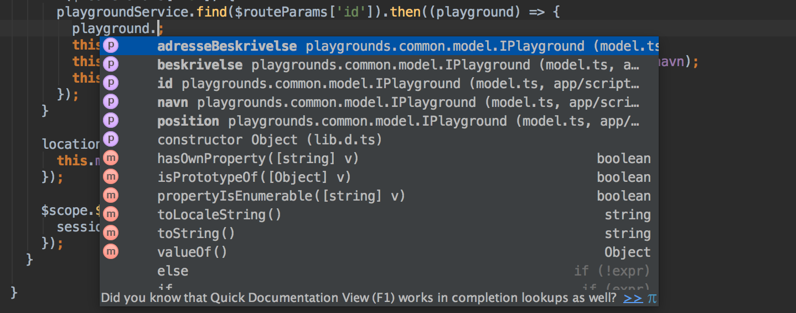

# AngularJS with TypeScript

## Introduction

AngularJS has become popular with many Danish companies. One of the attractive things about AngularJS is that it has many of the same virtues that can be found in other languages like Java and C#.

It has "separation of concerns" to clearly define how the parts of an applications should be split up. We have services for our business logic, controllers to bind the user flows to the business logic and directives & filters for presentation and so forth.

All this makes it easier for people with experience with the traditional MVC pattern to get started. At the same time, the code is also split up into smaller parts, which are both easier to reuse and certainly easier to test.

But one thing is still missing. Types! Possible solution: [TypeScript](http://www.typescriptlang.org/). What is TypeScript? According to Microsoft:

> TypeScript is a typed superset of JavaScript that compiles to plain JavaScript.

So what do we get with types? To be precise we get classes, interfaces, generics etc.. But why do we want it? Firstly with types, we get a paradigm that many developers understand. We get much more help from our IDE, we get the opportunity for automatic and safe refactoring and we get a compiler that can give us compile errors instead of runtime errors. All good things - especially in big projects that live long, curated by developers with different skill sets.

## Case - Playgrounds

In connection with this, I have held [AngularJS foundation](https://www.lundogbendsen.dk/undervisning/beskrivelse/LB1730/JS+-+AngularJS+-+Foundation;jsessionid=C8B2C9CCCEA83B5B27A05BFB76BDC4E3) courses for Lund&Bendsen, where the participants should make a little application that makes use of open data provided by [Copenhagen Data](http://data.kk.dk/) to show a list of playgrounds in Copenhagen.


The application is written in plain Javascript with AngularJS. But what does it take to go from a type-less application to an application that uses TypeScript? Let's take a look at the different parts.

## The model

There are clearly two models in this case. There is the model provided by Copenhagen Data and an internal model. When we use plain Javascript the model is not defined, but with TypeScript we can and should define these two models. We can achieve this with interfaces. The internal model is defined as follows:

```javascript
export interface ICoordinate {
  lat: number;
  lng: number;
}

export interface IPlayground {
  id: string;
  navn: string;
  adresseBeskrivelse?: string;
  beskrivelse?: string;
  position: ICoordinate;
}
```
This interface defines that a playground object **must** have `id`, `navn` (name) and `position`. The playground object **can** have `adresseBeskrivelse` (address description) and `beskrivelse` (description). The `?` after the name represents an optional property. What are the differences?

#### Compiling
By mistake, if we use `name` instead of `navn`, we will first get the error at runtime with plain Javascript. But if we use TypeScript, we'll get the error at compile time:

```
>> app/scripts/map/map.ts(58,22): error TS2339: Property 'name' does not exist on type 'IPlayground'.
```

I think this is a big advantage.

#### IDE
Another advantage with defined types, for example `IPlayground`, is that our IDE can now help us.

Since our IDE knows our types, we can benefit from code completion:



As we can see, our IDE is now aware of both `IPlayground`'s own properties and the inherited properties like `toString`

Without the `IPlayground` type, our IDE is not much help:


### Service
In our case with the playgrounds, the course participants will make a service that fetches playground information from Copenhagen Data. When the playground data is received, the service has a method that returns a promise that delivers an array with `IPlayground`s.

With TypeScript we can write our services as classes. And as with our model, we create an interface that describes the functionality our service shall implement. In this case, the interface will look like this:

```javascript
export interface IPlaygroundService {
  playgrounds(): angular.IPromise<IPlayground[]>;
  find(id: string): angular.IPromise<IPlayground>;
}
```
And in the service class itself:

```javascript
class PlaygroundService implements IPlaygroundService {
  public playgrounds(): angular.IPromise<IPlayground[]> {
    ...
  }

  public find(id: string): angular.IPromise<IPlayground> {
    ...
  }
}
```

Normally when we create a service in AngularJS, [we register it via the `factory` method](https://github.com/johnpapa/angular-styleguide#services). If we make use of TypeScript, it becomes more simple to use the `service` method, which in turn makes it much easier to register the service.

```javascript
angular.module('playgrounds')
  .service('playgroundService', PlaygroundService);
```

When `IPlaygroundService` gets injected into a controller, our IDE will help us with which functions we can call and our compiler will output errors if we try to use functions that don't exist.

This is how I use the service for example:

```javascript
class MapCtrl implements IMapScope {

  public playgrounds: IPlayground[];

  constructor($scope: angular.IScope, private $routeParams: angular.route.IRouteParamsService, playgroundService: IPlaygroundService, location: ILocationService) {
    playgroundService.playgrounds().then((playgrounds) => {
      this.playgrounds = playgrounds;
    });
    ...
  }
}
```
If we look in our IDE, we can see the type is known.


In this example, the IDE knows the return type `angular.IPromise<IPlayground[]>` from our `playgrounds()` function.

### Controller
When we use TypeScript, we write our controllers as classes too. It is easy to use the controllerAs syntax together with TypeScript, which is also the syntax I will use in the example. The example I will show is the controller that manages the map and the list of playgrounds.

We start by defining the properties and functions that our UI needs:

```javascript
interface IMapScope {
  filterTextService: IFilterTextService;
  markers: IMarker;
  playgroundCenter: ICoordinate;
  playgrounds: IPlayground[];
  selectedPlayground: IPlayground;
}
```

Afterwards, we implement the class itself.

In TypeScript we have a constructor function. We use this to inject the dependencies for the controller.

```javascript
class MapCtrl implements IMapScope {

  public static $inject = ['$scope', '$routeParams', 'playgroundService', 'location', 'filterTextService'];

  public playgrounds: IPlayground[];
  public selectedPlayground: IPlayground;
  public markers: IMarker = {};
  public playgroundCenter: ICoordinate = new MapCenter(Coordinate.DENMARK_CENTER, 8);

  constructor(private $routeParams: IRouteParamsService, playgroundService: IPlaygroundService, location: ILocationService, public filterTextService: IFilterTextService) {
    if ($routeParams['id']) {
      playgroundService.find($routeParams['id']).then((playground) => {
        this.selectedPlayground = playground;
        this.markers['playground'] = new MapMarker(playground.position, playground.navn);
        this.playgroundCenter = new MapCenter(playground.position);
      });
    }
    playgroundService.playgrounds().then((playgrounds) => {
      this.playgrounds = playgrounds;
    });
    location.get().then((coordinates) => {
      this.markers['meMarker'] = new MapMarker(coordinates, 'Her er jeg');
    });
  }
}
```

The constructor is also where we run the code that needs to be executed when the controller is instantiated. For this purpose, we fetch all the playgrounds and if a specific playground is selected, we fetch that.

Notice `$inject`. This static string array is required, if we want to [Uglify](https://github.com/gruntjs/grunt-contrib-uglify) our JS code.

Even though there is a little hassle in registering a service with AngularJS and TypeScript, it is very simple with controllers. Here we just give our class as a controller function.

```javascript
angular.module('playgrounds')
  .controller('MapCtrl', MapCtrl);
```

The advantage with having controllers in TypeScript is that we get compiler and IDE support when we are working with them. Unfortunately the IDE [Webstorm](https://www.jetbrains.com/webstorm/) can't help us in our HTML templates yet.

### Directives
We make directives in the same way as services and controllers. We make them with classes. The class we implement should use the interface `angular.IDirective`.

```javascript
class MyRating implements angular.IDirective {
  public restrict = 'E';
  public templateUrl = 'scripts/common/directives/my-rating.tmpl.html';
  public bindToController = {
    rating: '=',
    readOnly: '='
  };
  public scope = {};
  public controllerAs = 'vm';
  public controller = MyRatingController;

  public link(scope: angular.IScope, element: angular.IAugmentedJQuery, attrs: angular.IAttributes, vm: MyRatingController) {
    ...
  }
```

As we can see here, the individual property configurations can just be defined directly on the class.

This gives us the possibility to later inherit from this class and make a variant of our directive. I haven't needed to do this yet, but the opportunity exists in any case, when we use classes for our directives.

As we can see from the example, it is also of course possible to use `bindToController` in place of isolated `scope`, when we use TypeScript.

Unfortunately the process for registering a directive in AngularJS is not very elegant when we use TypeScript classes. But with a relatively simple static factory method on the class, we can get it to work a little easier:

```javascript
class MyRating implements angular.IDirective {

  ...

  public static factory() {
    const directive = (): angular.IDirective => {
      return new MyRating();
    };
    return directive;
  }
}

angular.module('playgrounds')
  .directive('myRating', MyRating.factory());
```

### Filters
Even though we can't implement filters as classes, we can still benefit from TypeScript's types. Mostly with the development of the filter and not with using the filter.

For the course, the participants had to make a `distance` filter. The filter should - using your  position and the location of the playgrounds - calculate the distance between you and the playgrounds. Let's start by defining the interface for this operation:

```javascript
export interface IDistanceFilter {
  (position: ICoordinate): string|number;
}
```

As we can see from `IDistanceFilter`, the interface describes one function that takes one parameter of the type `ICoordinate`. The filter function returns either a string or a number, which is represented by `string|number`. This is necessary if your position cannot be determined, so the function can return `'Ukendt'` (unknown).

The next step is to make the filter that returns the filter function, that implements `IDistanceFilter`.

```javascript
const distance = (location: ILocationService): IDistanceFilter => {

  let currentPosition: ICoordinate;

  location.get().then((position) => {
    currentPosition = position;
  });

  return (position: ICoordinate): number|string => {
    if (currentPosition && position) {
      return geolib.getDistance(currentPosition, position);
    }
    return 'Ukendt';
  };
};
distance.$inject = ['location'];
```

We register a `distance` function that takes a parameter: `location`. The parameter is dependency injected by AngularJS. The function itself returns a function that implements our `IDistanceFilter`.

Finally, we add our `$inject` property, so our filter can work with [Uglify](https://github.com/gruntjs/grunt-contrib-uglify).

It's super simple to register our filter with AngularJS:

```javascript
angular.module('playgrounds')
  .filter('distance', distance);
```
Unfortunately when we use our filter in a template we don't get any help from the IDE [Webstorm](https://www.jetbrains.com/webstorm/). So no code completion etc.. But our type interface gives us an advantage, if we inject our filter in a controller, service or directive. Or when we inject it in our test of the filter.

```javascript
beforeEach(inject((_humanizeDistanceFilter_: IHumanizeDistanceFilter) => {
  humanizer = _humanizeDistanceFilter_;
}));
```

### Third party libraries
In the examples we have looked at so far, we have primarily used our own types. But as you've surely noticed, we have also used other types. For example, `angular.IPromise<IPlayground[]>`. Where does this type come from? In TypeScript, it's possible to reference a definition. For example:

```javascript
/// <reference path='../../bower_components/DefinitelyTyped/angularjs/angular.d.ts' />
/// <reference path='../../bower_components/DefinitelyTyped/angularjs/angular-route.d.ts' />
/// <reference path='../../bower_components/DefinitelyTyped/angularjs/angular-resource.d.ts' />
```

A standard method to get these references in your project is to create a file that's called `_all.ts`. The file shouldn't contain anything other than links to third party libraries. The TypeScript compiler will - during the compilation of the project - use the references from this file, as long as it is included in the compilation.

The above types were all downloaded from the Github project [DefinitelyTyped](http://definitelytyped.org/). This project contains type definitions from 1,500+ Javascript libraries, so check it first!

But what now if we use a library that doesn't exist in [DefinitelyTyped](http://definitelytyped.org/)? Fortunately it is relatively simple to add our own definitions. In our case, we use a library called [Geolib](https://github.com/manuelbieh/Geolib). Since there is no definition for this library, we can make our own:

```javascript
declare module geolib {
  function getDistance(coordinate1: playgrounds.common.model.ICoordinate, coordinate2: playgrounds.common.model.ICoordinate): number;
}
```

Geolib offers more than one function, but we only need one here.

 Declarations like these should be saved with the extension `.d.ts`. In this example we end up with a file called `geolib.d.ts` that should be compiled with the rest of the project. This also gives IDE help and compiler type checking. See our [`distance`](#filters) filter for example:

```javascript
return (position: ICoordinate): number|string => {
  if (currentPosition && position) {
    return geolib.getDistance(currentPosition, position);
  }
  return 'Ukendt';
};
```

## Summary

### Advantages
It's easy to get started. In reality it's only necessary to rename all `.js` files to `.ts`. This won't give us all the advantages of types, but it gets us started.

TypeScript's syntax is relatively simple, especially for anyone with Java or C# experience and this slightly different syntax is easy to become accustomed to when we write our AngularJS code.

Our tools can help with code completion, refactoring, go-to declarations etc.. The compiler helps us to find errors we otherwise will first have seen at runtime.

### Disadvantages
Because we make use of interfaces and classes, along with some different AngularJS code we will end up with more lines.

It's cumbersome to write AngularJS with TypeScript without the right tools like [Grunt](http://gruntjs.com/) and [Gulp](http://gulpjs.com/). On the one hand, you could argue that no one writes AngularJS without tools, but on the other hand you could argue that we are moving away from the great thing about JavaScript; that you don't need an IDE, compilers or a debugger to get started.

And for me, the idea of compiling TypeScript to JavaScript is not especially appealing either. I must say though for compiling, that it's possible to create a mapping file so that you can debug your `.ts` files instead of your compiled `.js` files. This is a big help.

In conclusion, I think TypeScript is the way to go. The advantages outweigh the disadvantages and the benefits only become better as a project grows, compared to this little example with playgrounds.

## Source code

The source code is available on [Github](https://github.com/bregnvig/playgrounds)

The repository consists of three implementations of the same case:

* angular-with-scope
* angular-controller-as
* angular-typescript
